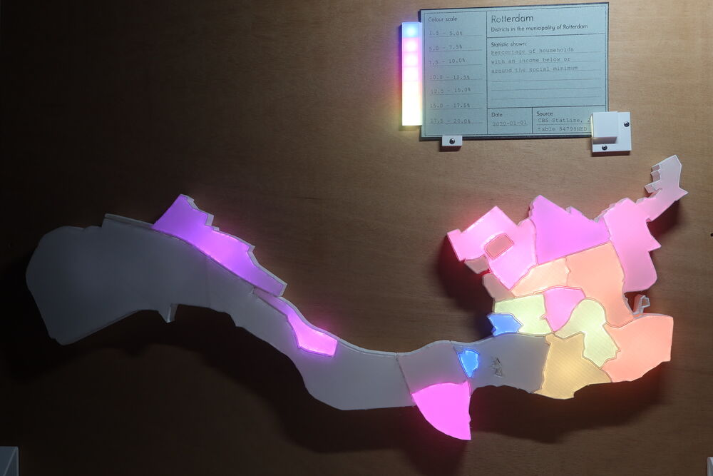

# LED Visualisation of Rotterdam

The visualisation consists of a number of 3D-printed 'light boxes' for each of the districts in the municipality of Rotterdam in The Netherlands. By inserting punch cards into the model, users are able to select different datasets for the visualisation. This was built as a prototype. The goal is invite users to look and play with statistical data.

Using a map of all districts in The Netherlands ([CBS and Kadaster](https://www.cbs.nl/nl-nl/dossier/nederland-regionaal/geografische-data/wijk-en-buurtkaart-2020)), the districts of Rotterdam were selected and each district was scaled and written to SVG-file. These were converted to 3D-models using OpenSCAD. The boxes were printed in white PLA and the covers were printed in transparent PLA. Holes were drilled in the back for the LEDS (took some experimenting to find the correct number and positions). The boxes were attached to each other using a 3D-printing pen and were attached to a muliplex board. 

Getting the correct diffusion of the LEDs took some experimenting. In the end small domes were printed in vase mode and glued over the LEDs. Furthermore a layer of LED foam was taped to the inside of the covers. However, even then the lighting in some of the larger districted is still not completely uniform. More LEDs would help; also the diffusors can probably be impoved upon. 

### Card 0: percentage of households with an income below or around the social minimum

[Data is from StatLine](https://opendata.cbs.nl/statline/#/CBS/nl/dataset/84799NED/table?dl=77FE6)

### Card 1: number of business locations per square kilometre

[Data is from StatLine](https://opendata.cbs.nl/statline/#/CBS/nl/dataset/84799NED/table?dl=77FE7)

### Card 2: Degree of urbanisation as measured by the local address density

[Data is from StatLine](https://opendata.cbs.nl/statline/#/CBS/nl/dataset/84799NED/table?dl=77FE4)

### Card 3: Average social economic status based on welfare, education and recent labour force participation

[Data is from StatLine](https://opendata.cbs.nl/statline/#/CBS/nl/dataset/85163NED/table?dl=77FD9)

### Card 4: Diversity in social economic status

[Data is from StatLine](https://opendata.cbs.nl/statline/#/CBS/nl/dataset/85163NED/table?dl=77FD9)

### Card 5: Change in the average social economic status from 2014 to 2019

[Data is from StatLine](https://opendata.cbs.nl/statline/#/CBS/nl/dataset/85163NED/table?dl=77FD9)

### Card 6: Percentage of persons aged younger than 25 years old

[Data is from StatLine](https://opendata.cbs.nl/statline/#/CBS/nl/dataset/84799NED/table?dl=77FE8)

### Back side

The visualisation is controlled by an Arduino Uno. All data is in the RAM of Uno. Three LEDs in combination with three photoresistors are responsible for reading out the cards. The cards canhave up to three holes in them. This means that there are 7 possible cards (numbers 0 to 6). All lights active (three holes; or no card) switches of the visualisation. The visualisation itself uses AP102 controllable RGB LEDs. The final 7 LEDS are the colour scale. Colour scales are also stored on the Uno. These consist of 7 colours + a no data colour. Each of the colours comes in two brighnesses. So in total there are 16 colours in one colour scale. The less bright colours are used for the smaller districts. This is to correct for the smaller area of the districts; this makes the light from the LEDs seem brighter. 

## Software

Code was written in the Arduino IDE. Models were made with R, OpenSCAD and FreeCAD. Data for uploading to the Arduino was prepared using R.

## Also see

[ntteloos.nl/rotterdam](https://ntteloos.nl/rotterdam)

## Licence

The code and models in this repository are licensed under [CC BY-SA 4.0](https://creativecommons.org/licenses/by-sa/4.0/).

